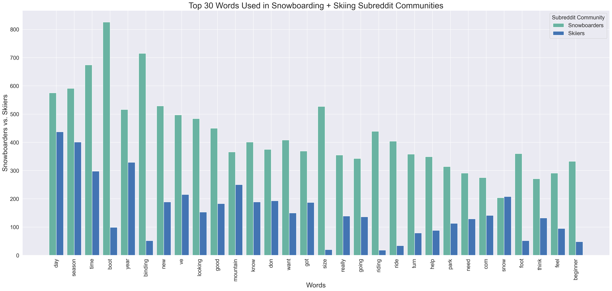

# Predicting Reddit Communities Using NLP and Classification Models
---

# Problem Statement
The snowboarding and skiing communities represent vibrant and rapidly growing segments within the sports industry. The winter season in 2021 marked the highest number of active skiers and snowboarders in over 25 years, with a 26% increase in less than a decade; and for the first time, the directionality of interest for snowboarding outpaced that of skiing (_[1](https://kenver.com/blogs/news/state-snow-sports)_). Participation winter sports are only expected to grow considering factors such as high consumer spending on outdoor activities (exacerbated by the COVID-19 pandemic), increasing number of winter sports events around the world, the growing focus on mental and physical health (_[2](https://www.factmr.com/report/229/snowboard-equipment-market)_).

The skiing and snowboarding communities exhibit unique and shared preferences, needs, and desires, presenting a meaningful opportunity for sports gear and apparel companies to cater to their specific requirements. By understanding, exploring, and attempting to address the characteristics of these communities, winter sports companies can capitalize on the opportunity to meet their diverse needs effectively, and members of the community themselves may maximize their performance by choosing the right brands, apparel, and accessories for themselves. For brands who would benefit from keeping or gaining more of the market share of these communities, such as Burton Snowboards, Inc., engaging further with the communities will empower them to develop tailored product offerings, refine marketing strategies, and strengthen their brand presence within these niche markets. 

In this analysis, we used natural language processing on two large subreddit communities to gauge the needs, preferences, interests, and other information needed that will allow Burton to target both the skiing and snowboarding  community effectively. The model we create at the end of this analysis is able to classify the originating community from which a subreddit post came.

At the end of this assignment, Burton will better understand how to leverage opportunities based on what the customers within these communities want. Ultimately, this should help them establish themselves as the preferred choice for gear manufacturer and/or sports apparel among snowboarders _and_ skiers, in turn driving business growth and fostering lasting customer relationships.

Source: [https://kenver.com/blogs/news/state-snow-sports](https://kenver.com/blogs/news/state-snow-sports)

# Data Dictionary

The data sourced for this analysis came from Reddit.com, a popular platform consisting of "subreddit" communities whose members share content and have discussions on topics of their interests. Reddit posts were pulled from two subreddits: snowboarding ("snowboardingnoobs"\*) and skiing ("skiing") communities. This was done using PRAW (the Python Reddit API Wrapper), a Python library that provides an interface to interact with the Reddit API, allowing me to extract posts from my chosen subreddits. 

I collected a diverse range of Reddit posts and saved/generated the variables below, serving as the foundation for my analysis and insights.

|Feature|Type|Source|Description|
|---|---|---|---|
|**created_utc**|*float*|Reddit (Direct)|Time the submission was created, represented in Unix Time | 
|**author**|*object*|Reddit (Direct)|Reddit user who is the author of the post | 
|**score**|*integer*|Reddit (Direct)|The number of net upvotes for the submission (upvotes - downvotes) |
|**upvote_ratio**|*float*|Reddit (Direct)|The percentage of upvotes from all votes on the submission |
|**num_comments**|*integer*|Reddit (Generated)|The number of comments on the submission|
|**text**|*object*|Reddit (Generated)|A combination of the title of a post and the accompanying self text, concatenated into one variable |
|**lem_text**|*object*|Reddit (Generated)|A lemmatized version of the text column (reducing each word to its base or dictionary form, considering the word's context and part of speech) |
|**stem_text**|*object*|Reddit (Generated)|A stemmed version of the text column (reducing each word to its root form by removing prefixes/suffixes/affixes, without consideration for the word's context or part of speech) |
|**post_length**|*integer*|Reddit (Generated)|The count of characters in the text column |
|**subreddit**|*object*|Reddit (Direct)|The subreddit community, converted for analysis to 1 for snowboarding and 0 for skiing  |

Please note: The Reddit community "snowboardingnoobs" was used in lieu of the wider snowboarding community, as the snowboarding community was not available during the Pushshift API protest (see [Data Acquisition and Cleaning](#1.-Data-Acquisition-and-Cleaning)). The substitution did not negatively impact our problem statement, as we are still able to gain sufficient insights on the needs of the snowboarding community and where/how Burton Snowboards can respond to identified opportunities.

# Executive Summary

## Background and Purpose
Snowboarding and skiing have a large presence in the global winter sports goods market, representing more than 30% (_[3](https://blog.gitnux.com/snowboarding-industry-statistics/)_). This market, including snowboarding and skiing gear, apparel, and accessories, is expected to expand at a steady rate over the next several years with a compound annual growth rate 4.4% through 2026 (_[4](https://blog.gitnux.com/snowboarding-industry-statistics/)_). The global snowboard equipment market, itself, is valued currently at \\$310M and is forecasted to reach \\$455M in the next decade, expanding at 3.9% CAGR (_[5](https://www.factmr.com/report/229/snowboard-equipment-market)_). With approximately double as many skiers as there are snowboarders, we can expect at least similar growth in skiing equipment manufacturing. 

It is in the best interest of Burton Snowboards, Inc. to continue it's dominance in this highly competitive field by keeping their current customers and gaining new ones, such a new snowboarders and current and new skiers as well. While Burton's reputation, brand, and market share are strong, there are still many competitors also doing very well in the winter sports market, such as Salomon Group, Quiksilver, Inc., Amer Group, K2 Snowboards, and Avalanche Snowboards. Burton also faces challenges of seasonality, evolving consumer preferences, environmental concerns, and international branding/presence. Therefore, it is more important than ever for Burton to establish consumer loyalty, foster innovation, and expand its following to ensure long-term success and sustainability.

With our model, Burton Snowboards can understand consumer preferences at any given time, target advertisements, customize promotional offers, or strategically seek partnerships to optimize outreach and influence.

## Initial Findings
##### Baseline Model
In order for our model to be useful, it needed to outperform the baseline model/majority class of **51.2%**.

##### Accuracy and Precision
- Using logistic regression with TfidfVectorizer for natural language processing, our final model did the following:
    - Accurately predicted/classified if a post came from the snowboarding or skiing subreddit **88.4%** of the time. 
    - Accurately predicted/classified a post to be coming from the Snowboarding subreddit **91.3%** of the time. 

##### Text Patterns and Word Exploration
- Top words among the **snowboarding** subreddit appear to potentially align more with <u>_gear and performance_</u>, or the <u>_experience **in or during** the activity_</u>. 
    - Notable words among the Top 50 include, boot, binding, gear, mountain, Burton, heel, toe, edge, and jump.
- Top words among the **skiing** subreddit appear to potentially align more with the <u>_experience **around** the activity_</u>, such as the best place to go or best time of year. 
    - Notable words among the Top 50 include, day, season, time, year, week, resort, powder, and trip.
    - Top bigrams included mention of many places, such as east coast, North America, Jackson Hole, Park City, Winter Park, Palisade Tahoe, Lake Tahoe, Vail resort, best resort.
    - They also mention the best passes, such as epic pass, season pass, and Ikon pass.

## Methodology and Analysis
To complete this analysis, a Logistic Regression model was built using TfidfVectorizer on the text of each subreddit post. This method gave a numerical representation to each word in the post and assigned weights based on word-frequency, quantifying the importance per word. Several models were tested and compared using GridSearchCV and RandomizedSearchCV across several tuned hyperparameters. Ensembling was attempted to enhance testing accuracy, as was Random Forest in attempt to reduce any overfitting.

The high-level process for this analysis is outlined below.

#### 1. Data Acquisition and Cleaning
Data was acquired using PRAW API, which created an instance of the Reddit class, authenticated my credentials, and allowed me to retrieve subreddit information for the communities of my choosing. For more information, see [official PRAW documentation](https://praw.readthedocs.io/en/stable/index.html).  

Two methods were explored for pulling Reddit data via PRAW. Both were tested, and ultimately Method 2 was chosen to maximize the number and diversity of posts. 

1. <u>**Method 1**</u>: Pulling the Top 700 newest posts and Top 500 "top" posts which occurred earlier than the newest posts - focus was on the new and top posts and then using the dates there should be no or little overlap.
2. <u>**Method 2**</u>: Pulling Top 1000 posts from New, Hot, Top, and Controversial channels and de-duplicating - focus was on variety and getting more posts.

Note: These methods were developed in response to recent changes/restrictions in Reddit's Pushshift API, which required adjustments to the way data is retrieved and processed. Read more about the decision [here](https://techcrunch.com/2023/04/18/reddit-will-begin-charging-for-access-to-its-api/) and response [here](https://www.theverge.com/2023/6/12/23755974/reddit-subreddits-going-dark-private-protest-api-changes).

Data cleaning mainly included manipulation of variables such that there was no missing or anomalous text. 
- The post title and post selftext were concatenated into a single object, thus eliminating any missing values. 
- Words were tokenized using RegexpTokenizer('\w+'), keeping only word characters (letters, digits, and underscores) and discarding any non-word characters such as punctuation marks, spaces, or special symbols.
- Words were lemmatized and stemmed for potential future use. 
- Leftover line breaks (appearing as '\n' in the text) and any other HTML print was removed.

#### 2. Data Exploration and Visualization
Several variables were explored to understand the frequency and type of engagement in the subreddit communities, including:
- Post length (characters)
- Word count per post
- Number of upvotes per post 
- Number of comments per post
- User-level exploration and averages (post length, word count, upvote ratio, average comments, etc. by author)
- Top unigrams, bigrams, trigrams exploration with CountVectorizer
    - Overall
    - By Top 25% of most upvoted posts
    - By Top 25% of most commented posts

Visualizations were included in each exploration, mainly including:
- Scatterplots (with regression line), pairplots, histograms, or correlation matrices/heatmaps for all continuous and/or numeric variables
    - Outliers were informed by these visuals and explored/processed appropriately
- Barplots or boxplots for categorical variables or discrete with small ranges
- Descriptive Statstics tables for all non-categorical variables

#### 3. Data Transformation and Modeling
##### Pre-Processing and Modeling
Once our data was completely cleaned, manipulated, and explored, data transformation and modeling took place via pipelining and hyperparamter tuning. We started by taking a train_test_split (75% training/25% testing) of our data, and then testing various classification models using one transformer and one estimator via pipeline automation, GridSearchCV and RandomizedSearchCV with cross validation. Ultimately, 4 models (and 1 Ensembling attempt) were tested using either CountVectorizer or TfidfVectorizer to transform text data for processing, accuracy reports and/or Confusion Matrices were conducted for each, and overall model considerations were assessed. Below is a summary of each model and the parameters tuned.

1. <u>**Model 1**</u>: Logistic Regression (C, penalty)
2. <u>**Model 2**</u>: Multinomial Naive Bayes (alpha)
3. <u>**Model 3**</u>: Suport Vector Machine (C, kernel, degree)
4. <u>**Model 4**</u>: Random Forest and Extra Trees (n_estimators, max_depth)
    - Performed in attempt to reduce overfitting

Each model was tested with both _CountVectorizer_ and _TfidfVectorizer_, with the following general features:
 - With and Without English stopwords
 - Max features
 - Min_df and Max_df

##### Modeling Considerations
<u>Ensembling</u> the LR, MNB, and SVM models was tested, but did not lead to gain in model accuracy, so was discontinued.

<u>Lemmatized</u> and <u>Stemmed</u> text was briefly explored, however, did not lead to much gain in modeling accuracy, therefore was not considered further. Moreover, <u>custom stop words</u> were created which included words that strongly help our model in identifying the subreddit from which a post originated (e.g., words such as snowboard, snowboarding, ski, skiing). These custom words were tested as stop words in our models, but were ultimately excluded from further consideration. While accuracy scores of the models still ranged around ~70-80%, meaningfully outperforming the baseline model, introducing this additional complexity to our model was unnecessary and not aligned with our problem statement. We seek to classify posts into two group to assure that the correct content is tailored to them, and the easier we can make this, the more beneficial it will be to the client (Burton Snowboards) and their target audience.

##### Final Testing Scores
Each model outperformed the baseline significantly, but each model performed similarly in terms of accuracy. For details on the final model selected, see subsequent section.

#### 5. Key Findings and Insights 

Based on this exploration, below are key insights drawn in understanding the subreddit community and the final model used for predicting which community a post came from.

##### Final Model
The **Logistic Regression using TfidfVectorizer transformation** was selected to be the final model. While the accuracy of Logistic Regression and SVM models was similar, and both were slightly less than the Ensembling approach, we chose Logistic Regression for its advantages in terms of **simplicity, interpretability, and computational efficiency**. 
- The fitting process of Logistic Regression was notably faster, taking approximately **30 seconds** with GridSearch and even less time with RandomizedSearch. In contrast, the SVM model took **95 seconds** with GridSearch and 23.5 seconds with RandomizedSearch.
- Additionally, the SVM model exhibited slightly more overfitting compared to Logistic Regression. 
    - Considering whatever the potential frequency of retraining the data may be (e.g., seasonally, around holidays, during relevant sporting events, etc.), opting for a simpler and faster model like Logistic Regression can be advantageous. 
- For our specific problem statement, prioritizing accuracy over metrics such as sensitivity and specificity is more important. 
    
Our final model took on the following parameters and achieved an accuracy of **88.4%**, precision of **91.3%**, sensitivity of **85.2%**, and specificity  of **91.6%**.
- TfidfVectorizer(max_df=0.85, max_features=8000, min_df=2)
- C=5.577778
- penalty='l2'

While we are not ultimately using our Random Forest model, we were able to gain insights into top "feature importances" which helped train our model and calculate the accuracy score. These features were very likely among the top contributors in training our final logistic regression model as well.

##### Community Engagement
- On average, the snowboarding subreddit community engaged with each other by posting longer messages (mean length: 345 characters and 62 words per author, compared to 170 characters and 31 words in the skiing community) and upvoting fewer messages and/or upvoting without comment/further engagement (mean upvotes: 34 vs. 762 in the skiing community).
- On average the skiing community engaged with each other by upvoting more messages and commenting more with each post (mean comments: 56 per author post vs. 15 in the snowboarding community)

    
- The skiing subreddit community had a much stronger correlation between post score and number of comments (R = 0.59, respectively), potentially indicating higher discussion-based engagement, whereas snowboarding may be more informative posts, stories, announcements, or otherwise posts which do not create as much need for discussion or comment beyond giving an upvote. 
    

##### Community Top Words 
- Top words among the snowboarding community had more to do with gear, performance, technique, or the experience **in or during** the activity. Whereas, top words among the skiing community aligned more with the experience **around** the activity, such as the best place to go, the best time of year, the best passes to get (epic pass, season pass, Ikon pass). 
    - It is possible that, compared to the snowboarding community, the skiing community had more members planning general ski trips/vacations, likely including members who did not intend to partake in any slope activity at all. Therefore there may be more conversations around trip planning and recommendations, rather than the act of skiing itself - which does not seem to be the case as much for the snowboarding community. 

- Notable words from the snowboarding community included boot, binding, gear, mountain, Burton, heel, toe, edge, and jump. Notable words among the skier Top 50 include, day, season, time, year, week, resort, powder, and trip.

- Notable bigrams among the skiing community was the mention of several skiing locations, such as east coast, North America, Jackson Hole, Park City, Winter Park, Palisade Tahoe, Lake Tahoe, Vail resort, and best resort. 

Leveraging the insights gained from our community exploration, Burton Snowboards can proactively and strategically connect with consumers, taking targeted actions that align with their distinct interests.

#### 6. Conclusion and Next Steps

Based on the findings of this analysis, below are the key recommendations for Burton Snowboards to focus on which will help them retain current customers and gain new ones.

<u>**_1. Focus for Snowboarders_**</u>

Whether for current snowboarding customers or new, our model should be used to classify Reddit users in the snowboarding community for targeted advertising. Burton should continue with current digital transformation efforts to increase E-commerce and direct-to-consumer business by doing the following:
1. <u>**Marketing**</u>: Advertise **promotional offers** and **exclusive discounts** to the snowboard community for gear and accessories
2. <u>**Partnerships**</u>: Partner with professionals and snowboard schools to package **lessons and rentals/equipment** if bought through Burton
3. <u>**Content Creation**</u>: Create and deliver targeted content (video tutorials, blog articles, social media posts) on **technical tips and tutorials**

<u>**_2. Focus for/on Skiers_**</u>

In the USA, there are roughly twice as many skiers as snowboarders (15 vs. 8M)(_[6](https://www.statista.com/topics/1770/winter-sports/#topicOverview)_), therefore, it is critical that Burton expand their reach to more skiers using our model. While the equipment needs of skiers and snowboarders are different, Burton must conduct outreach to more skiers about their high-performance apparel and accessories, which can be enjoyed by skiers and snowboarders alike. The following actions are recommended:
1. <u>**Partnerships**</u>: Leverage the skiing communities interest in trip-planning by **partnering with ski resorts and travel agencies** to create exclusive packages that include discounted apparel from Burton, as well as exclusive offers on lift tickets, equipment rentals, and lodging.
    - <u>**Global Expansion**</u>: Leverage any traction gained by these partnerships to expand Burton's **global presence and reputation**, especially in European countries with a high participation of winter activity (e.g., Austria, France, Italy, Switzerland) (_[7](https://www.factmr.com/report/229/snowboard-equipment-market)_). 
    - Options include expanding retail stores in these locations (either at the resorts or in the general area), and/or by hosting joint skiing and snowboarding events in these areas.
2. <u>**Website Promotion**</u>: Promote skiing section of Burton's website by directing skiers to **special/exclusive apparel and accessory offers**
3. <u>**Travel Guide**</u>: Develop travel and destination guides highlighting the **best ski resorts or locations** for winter activity. Provide insights on optimal times of the year to plan the activity, and showcase the utility and **advantages of Burton** products as essential gear.
        

By leveraging our model, Burton Snowboards can gain valuable insights into consumer preferences in real-time and target both the snowboarding and skiing communities. This empowers the company to effectively target advertisements, tailor promotional offers, and strategically pursue partnerships that maximize outreach and influence. With a deeper understanding of their target audience, Burton Snowboards can optimize their marketing efforts and enhance their overall brand positioning in the market.

To adapt to the evolving landscape of consumer engagement across the year and over time, important next steps for Burton should also be the <u>regular retraining and recalibration</u> of the model using updated data. Burton should consistently be gaining insights into community interests not only in real-time, but documenting this across various seasons, holidays, and local/global competitions, ensuring the development of only highly relevant promotions and vacation packages.